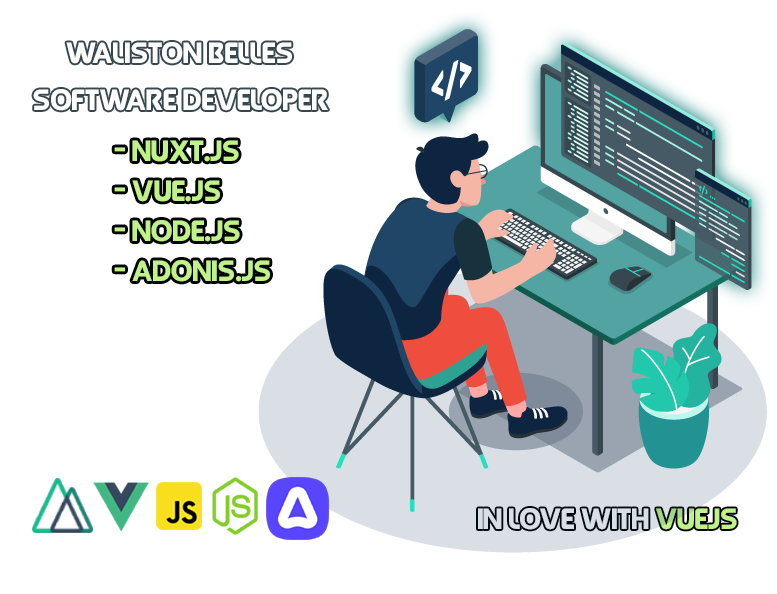

<h1 align="center">
  
</h1>
### Olá 👋

Sou Waliston, desenvolvedor web, formado em Análise e Desenvolvimento de Sistemas. Atualmente estou atuando como desenvolvedor Fullstack, trabalhando com NuxtJs e AdonisJS.
Também atuo como principal contribuidor do projeto <a href="https://github.com/ElectroAAC/electro">ElectroAAC</a>, um projeto Open Source de minha autoria voltado para comunidade de Tibia.

 

